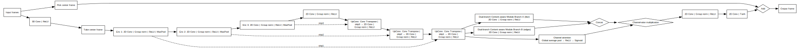

# Video Pre-Processing for Perceptual Quality Enhancement

This repository provides a deep learning-based pre-processing algorithm that enhances perceptual quality of processed images and video frames. The model learns to transform input frames to optimize for downstream quality metrics while maintaining visual fidelity.

**Project status:** Training and inferencne are completed. Evaluation results are available in its respective folder in this directory.

**Model Architecture**


This work builds a **U-Net inspired encoder-decoder** architecture with:

- **Temporal context integration** via 3D convolutions for multi-frame input
- **Skip connections** for preserving fine details during upsampling
- **Detail Compensation Module (DCM)** with dual-branch processing (blur and edge enhancement)
- **Channel attention** for content-adaptive feature weighting
- **Residual connection** to preserve input characteristics

To generate sequences of different quality, I used **x265** as the primary encoder. Other encoders can also be used and tested for performance.

## Note: 
Found a bug or have an improvement? Contributions are welcome! 🙌
1. **Open an issue** with a minimal repro (dataset slice, command line, logs).
2. **Submit a Merge Request / Pull Request** referencing the issue.
3. Please follow this checklist:
   - Clear description of the bug/fix
   - Steps to reproduce (commands, args, env details)
   - Affected files

I will review merge requests and leave feedback or merge when ready. Thanks for helping improve the project! 🚀

# Motivation
Many image and video processing pipelines optimize at the algorithmic level (compression, transmission, enhancement). This work takes a complementary approach: **learn to pre-process content** before it enters a processing pipeline such that the output achieves better perceptual quality metrics.

- Key advantages:
  - **Pipeline-agnostic**: Works with various downstream processors (compression codecs, neural networks, image processing algorithms)
  - **Perceptually-driven**: Optimizes directly for target quality metrics via differentiable proxies 
  - **Minimal overhead**: Single-pass pre-processing before the main pipeline
  - **Content-adaptive**: DCM module adjusts processing based on input characteristics
  - **End-to-end learnable**: Trained with differentiable proxy models representing the full pipeline

# Use Cases
This approach can be applied to various scenarios:
- **Video compression**: Pre-process frames before encoding to improve rate-distortion performance
- **Image transmission**: Optimize images before lossy transmission or storage 
- **Super-resolution preprocessing**: Prepare low-resolution inputs for better upscaling results
- **Neural network preprocessing**: Optimize inputs for downstream neural architectures
- **Medical imaging**: Enhance images before diagnostic processing while preserving fidelity

# Training Pipeline
The model is trained using proxy models to enable end-to-end differentiable optimization:
 - **Quality Metric Proxy**: A pre-trained neural network that estimates perceptual quality scores (e.g., VMAF, SSIM, LPIPS). The code for this netowrk is available in my repository.
 - **Processing Pipeline Proxy**: A pre-trained model that simulates the downstream processing operation. The code for this netowrk is available in my repository.
 - **Pre-Processor Network**: The trainable model that learns optimal pre-processing transformations

# Training Features
- **Multi-frame temporal window**: Center frame is preprocessed using context from neighbors (t-1, t, t+1)
- **Random spatial crops** during training for data augmentation
- **Conditional processing**: Model learns across multiple processing parameter settings
- **Gradient clipping**: Both value and norm clipping for training stability
- **Early stopping**: Prevents overfitting on validation set
- **Reproducible**: Fixed random seeds for deterministic results

# Dataset
Training uses the YouTube UGC 720p Dataset with:
- High content diversity (real-world user-generated scenes)
- Wide range of processing parameters for robust learning
- Train/Validation/Test splits for proper evaluation
- Balanced sampling across quality levels

Each sample includes:
- Reference frame triplet (t-1, t, t+1)
- Corresponding processed frames
- Ground-truth quality scores
- Processing parameter metadata

## Runtime environments

This codebase is **Vertex AI–first**:

- **Primary target**: Google Vertex AI (custom training jobs), GCS storage, and `gs://` paths.
- **Local runs**: It is supported, but you may need to turn off cloud-only features and/or install extra packages.

### Run on Google Vertex AI

```bash
gcloud ai custom-jobs create --region=us-central1 --display-name=filter-proxy --config="C:/Users/User/Desktop/DL/FilterProxy/Trainer/config_local_short.yaml"
```
- **config.yaml**:
```bash
workerPoolSpecs:
  - machineSpec:
      machineType: g2-standard-32
      acceleratorType: NVIDIA_L4
      acceleratorCount: 1
    replicaCount: 1
    diskSpec:
      bootDiskType: pd-ssd
      bootDiskSizeGb: 2000
    containerSpec:
      imageUri: us-docker.pkg.dev/vertex-ai/training/pytorch-gpu.2-0.py310:latest
      command: ["bash","-lc"]
      args:
        - |
          set -euxo pipefail
          export DEBIAN_FRONTEND=noninteractive MALLOC_ARENA_MAX=2
          apt-get update -y
          apt-get install -y google-cloud-cli
          # Check if data exists from previous run in the same session
          if [ ! -d "/data/dataset" ] || [ -z "$(ls -A /data/dataset)" ]; then
            echo "Downloading dataset..."
            mkdir -p /data/dataset
            gsutil -m rsync -r gs://vmaf_proxy_dataset/dataset /data/dataset
          else
            echo "Dataset exists, skipping download"
          fi
          python -m pip install -U pip
          gsutil cp -n gs://vmaf_proxy_code/trainer-0.1.tar.gz /tmp/trainer-0.1.tar.gz
          python -m pip install --no-cache-dir /tmp/trainer-0.1.tar.gz google-cloud-storage gcsfs
          df -h /
          df -h /data
          python -u -m Trainer.task \
            --csv_file=gs://vmaf_proxy_dataset/dataset/proxy_vmaf_groups.csv \
            --root_dir=/data/dataset \
            --output_dir=/tmp/checkpoints \
            --use_plateau_scheduler \
            --early_stop
```
## Repository layout
```text
vmaf_proxy/
├─ README.md
├─ LICENSE
├─ gitignore
├─ architecture.svg
├─ src/
│  └─ filter_proxy/
│     ├─ data/
│     │  └─ filter_data_loader.py  # Dataset loader for frame pairs
│     ├─ models/
│     │  └─ model.py             # PreProcessorNet architecture
│     └─ train/
│        └─ train.py             # Training script with proxy models
│     └─ inference/
│        └─ infer_and_eval.py    # # Inference and evaluation script
│        └─ README.md        # Evaluation and analysis results
├─ scripts/
│  ├─ compress.py              # encode sources at CRFs (x264/x265/SVT-AV1)
│  ├─ compute_vmaf.py          # produce frame-level VMAF JSON logs
│  ├─ extract_frames.py        # dump gray PNG frames for ref/dist
│  ├─ generate_csv.py          # parse VMAF JSON to per-split CSVs
│  ├─ build_groups.py          # combines multiple CSVs into one + balancing
│  └─ dataset_split.py         # split raw videos into train/val/test
```
